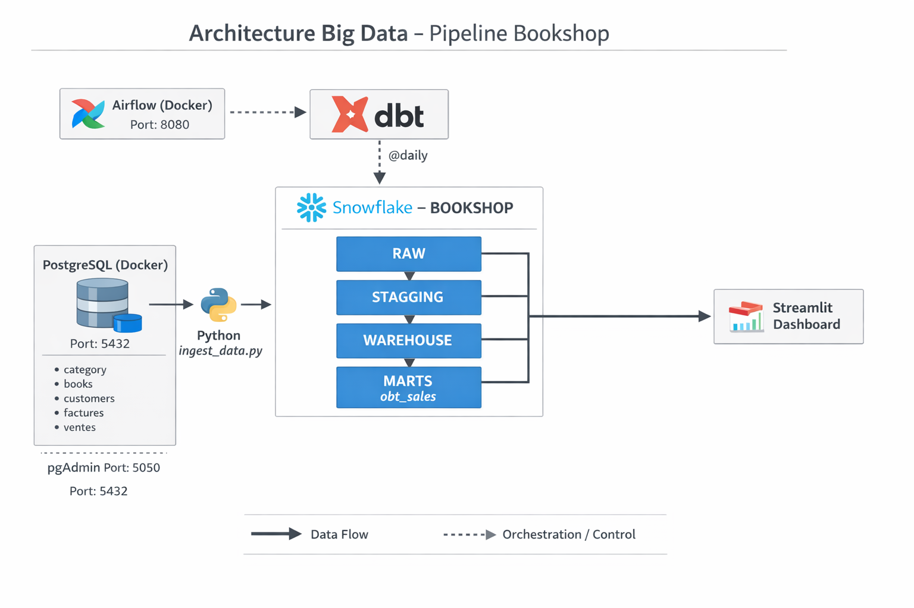
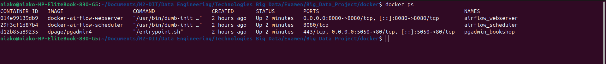
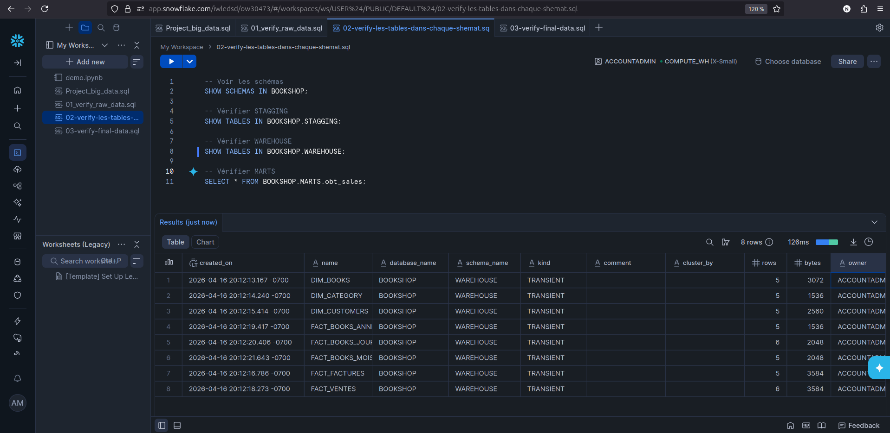
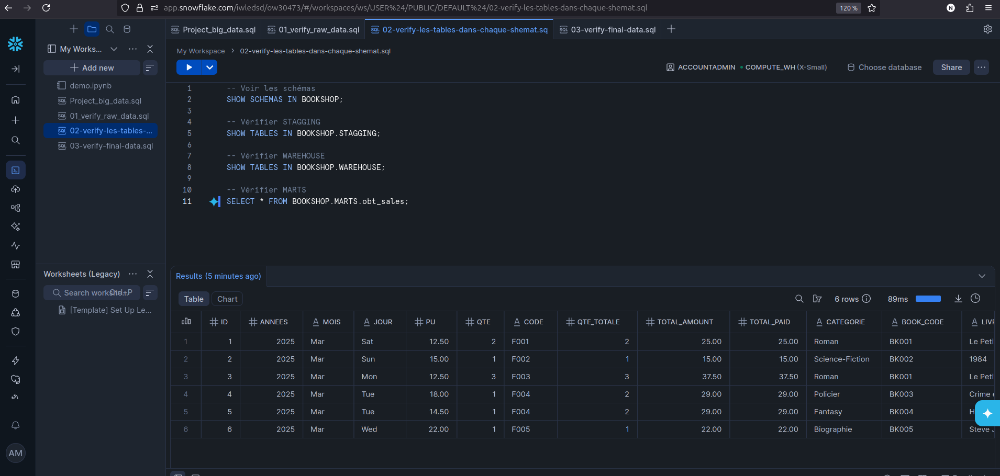
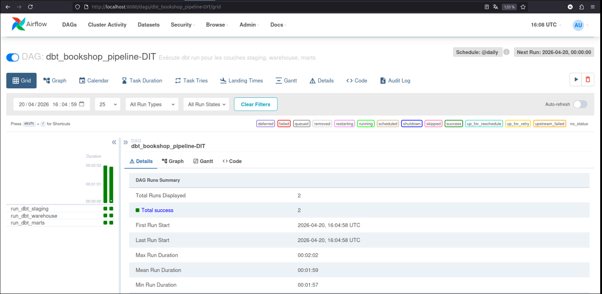
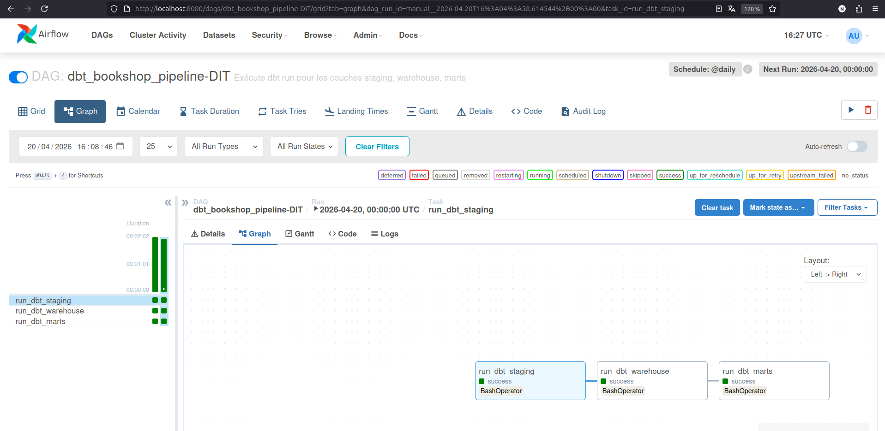

# Big Data Project – Bookshop

## Objectif du projet

Transformer des données brutes de vente de livres en une **table unique OBT (One Big Table)** prête pour l’analyse.  
Pipeline complet allant de PostgreSQL (local) à Snowflake (cloud), avec transformations DBT et orchestration Airflow.

---

## Architecture globale


```
BOOKSHOP (base Snowflake)
│
├── RAW         ← Données brutes (ingérées depuis PostgreSQL)
├── STAGGING    ← Données nettoyées (dates converties)
├── WAREHOUSE   ← Dimensions + faits (modèle en étoile)
└── MARTS       ← Table unique obt_sales (prête pour la BI)
```

---

## Structure du projet (VS Code)

```
Big_Data_Project/
├── .dbt/                              # Configuration DBT (connexion Snowflake)
│   └── profiles.yml                   # Identifiants Snowflake, warehouse, schéma par défaut
│
├── dags/                              # DAGs Airflow (orchestration)
│   └── dbt_pipeline.py                # Définit l’ordre d’exécution des modèles DBT
│
├── docker/                            # Déploiement Docker des services
│   └── docker-compose.yml             # Lance PostgreSQL, pgAdmin, Airflow (webserver, scheduler, init)
    └──Dockerfile   # Construction personnalisée de l’image Airflow
│
├── models/                            # Modèles DBT (transformations SQL)
│   ├── staging/                       # RAW → STAGGING (nettoyage)
│   │   ├── sources.yml                # Déclare les tables sources (RAW)
│   │   ├── stg_category.sql           # Copie de la table category
│   │   ├── stg_books.sql              # Copie de la table books
│   │   ├── stg_customers.sql          # Copie de la table customers
│   │   ├── stg_factures.sql           # Conversion date_edit en DATE
│   │   └── stg_ventes.sql             # Conversion date_edit en DATE
│   ├── warehouse/                     # STAGGING → WAREHOUSE (modélisation)
│   │   ├── dim_category.sql           # Dimension catégorie (copie)
│   │   ├── dim_books.sql              # Dimension livre (copie)
│   │   ├── dim_customers.sql          # Dimension client + colonne "nom" (concaténation)
│   │   ├── fact_ventes.sql            # Fait ventes + année, mois, jour
│   │   ├── fact_factures.sql          # Fait factures + année, mois, jour
│   │   ├── fact_books_annees.sql      # Agrégation ventes par année
│   │   ├── fact_books_mois.sql        # Agrégation ventes par mois
│   │   └── fact_books_jour.sql        # Agrégation ventes par jour
│   └── marts/                         # WAREHOUSE → MARTS (table finale)
│       └── obt_sales.sql              # Jointure unique : obt_sales (OBT)
│
├── scripts/                           # Scripts d’ingestion et d’initialisation
│   ├── ingest_data.py                 # Transfère les données PostgreSQL → Snowflake.RAW
│   ├── init_postgres.sql              # Crée les tables PostgreSQL et insère les données de test
│   └── create_tables_snowflake.sql    # (Optionnel) Crée les tables RAW dans Snowflake
    └── init_airflow.sql               # Création de la base de données Airflow dans PostgreSQL
│
├── macros/                            # Macros DBT personnalisées
│   └── generate_schema_name.sql       # Force DBT à utiliser les schémas définis dans les modèles
│
├── images/                            # Captures d’écran pour la documentation
│   ├── docker-ps-tt-nos-conteuneur-sont-en-running.png
│   ├── creation-bd-et-shemat-et-tables-dans snowflak.png
│   ├── verification-des-donnees-apres-ingestion-dans snowflak.png
│   ├── verification-apres-dbt.png
│   ├── sucess-airflow-1.png
│   ├── sucess-aiflow-2.png
│   └── 6vente.png
│
├── dashboard.py                       # Dashboard Streamlit (visualisation des ventes)
├── requirements.txt                   # Dépendances Python (snowflake, dbt, airflow, pandas, streamlit, etc.)
├── dbt_project.yml                    # Configuration du projet DBT (chemins, materialisation)
├── .gitignore                         # Fichiers ignorés par Git (venv, target, etc.)
└── README.md                          # Documentation principale (ce fichier)
```

---

## Étapes réalisées

### 1. PostgreSQL avec Docker (Niako)

**Objectif** : disposer d’une base locale pour les données brutes.

- Fichier `docker/docker-compose.yml` lancant **PostgreSQL 15** (port 5432) et **pgAdmin 4** (port 5050).
- Script `scripts/init_postgres.sql` exécuté au premier démarrage : création des 5 tables (`category`, `books`, `customers`, `factures`, `ventes`) et insertion de données de test (5‑6 lignes par table).

**Commandes** :
```bash
cd docker
docker-compose up -d
docker ps
```

**Accès** :
- pgAdmin : http://localhost:5050 (admin@bookshop.com / admin2026)
- PostgreSQL : localhost:5432 (adminan / admin2026)

**Capture** – Conteneurs PostgreSQL, pgAdmin et Airflow en cours d’exécution :


---

### 2. Snowflake – Création de la base et des schémas (Aliou / Niako)

- Compte Snowflake (free trial 30 jours)
- Base `BOOKSHOP`
- Schémas : `RAW`, `STAGGING`, `WAREHOUSE`, `MARTS`

**Capture** – Création de la base, des schémas et des tables RAW dans Snowflake :


---

### 3. Ingestion des données (PostgreSQL → Snowflake)

Script `scripts/ingest_data.py` (Python) :
- Connexion à PostgreSQL (Docker) et à Snowflake
- Lecture des tables locales
- Insertion dans le schéma `RAW` de Snowflake

**Résultat** après ingestion :

```
category: 5 lignes
books: 5 lignes
customers: 5 lignes
factures: 5 lignes
ventes: 6 lignes
```

**Capture** – Vérification des données brutes dans Snowflake après ingestion :


---

### 4. Transformations DBT

DBT construit les couches **STAGGING**, **WAREHOUSE** et **MARTS** à partir des données brutes.

#### Modèles staging (nettoyage)
- `stg_category.sql`, `stg_books.sql`, `stg_customers.sql` : copies simples
- `stg_factures.sql`, `stg_ventes.sql` : conversion des dates (`TO_DATE(date_edit, 'YYYYMMDD')`)

#### Modèles warehouse (modélisation analytique)
- Dimensions : `dim_category`, `dim_books`, `dim_customers` (avec colonne `nom` = `first_name || ' ' || last_name`)
- Faits : `fact_ventes`, `fact_factures` (ajout de `annees`, `mois`, `jour`), `fact_books_annees`, `fact_books_mois`, `fact_books_jour`

#### Modèle marts (table finale OBT)
- `obt_sales` : jointure entre `fact_ventes`, `fact_factures`, `dim_books`, `dim_category`, `dim_customers`

**Problème rencontré** : DBT créait des schémas avec double préfixe (`STAGGING_STAGGING`).  
**Solution** : macro `macros/generate_schema_name.sql` :

```sql

    {{ custom_schema_name }}

```

**Commandes DBT** :
```bash
source venv/bin/activate
dbt run --full-refresh
dbt docs generate
dbt docs serve
```

**Résultats finaux** :

| Schéma    | Tables                                                                 |
|-----------|------------------------------------------------------------------------|
| STAGGING  | stg_category, stg_books, stg_customers, stg_factures, stg_ventes       |
| WAREHOUSE | dim_category, dim_books, dim_customers, fact_ventes, fact_factures, fact_books_annees, fact_books_mois, fact_books_jour |
| MARTS     | obt_sales (6 lignes)                                                   |

**Captures** :
- Vérification après DBT : 
- Extrait de `obt_sales` (6 ventes) : 

---

### 5. Orchestration Airflow

Airflow exécute automatiquement les modèles DBT dans l’ordre.

#### Configuration Docker
- Services : `airflow-webserver` (port 8080), `airflow-scheduler`, `airflow-init`.
- Volumes montés : `dags/`, `models/`, `dbt_project.yml`, `.dbt/`, `requirements.txt`.

#### DAG : `dbt_bookshop_pipeline` (fichier `dags/dbt_pipeline.py`)

```python
# Import des classes pour gérer le temps (date et délai)
from datetime import datetime, timedelta

# Import de la classe principale pour créer un DAG Airflow
from airflow import DAG

# Import de l'opérateur pour exécuter des commandes bash
from airflow.operators.bash import BashOperator


# Dictionnaire des paramètres par défaut appliqués à toutes les tâches
default_args = {
    'owner': 'niakoaliou',  # Propriétaire du DAG (utile pour tracking/logs)

    'depends_on_past': False,  
    # Si True → une tâche dépend du succès de son exécution précédente
    # Ici False → chaque run est indépendant

    'start_date': datetime(2025, 4, 1),  
    # Date à partir de laquelle Airflow peut commencer à planifier le DAG

    'retries': 1,  
    # Nombre de tentatives si une tâche échoue

    'retry_delay': timedelta(minutes=5),  
    # Temps d’attente entre deux tentatives
}


# Création du DAG
dag = DAG(
    'dbt_bookshop_pipeline-DIT',  
    # Identifiant unique du DAG dans Airflow (très important)

    default_args=default_args,  
    # Applique les paramètres définis plus haut

    description='Exécute dbt run pour les couches staging, warehouse, marts',  
    # Description visible dans l’UI Airflow

    schedule_interval='@daily',  
    # Planification → exécution tous les jours

    catchup=False,  
    # Ne pas exécuter les DAGs passés (évite backlog massif)
)


# Définition du répertoire du projet dbt dans le conteneur
DBT_PROJECT_DIR = '/opt/airflow'
DBT_PROFILES_DIR = '/opt/airflow/.dbt'  


# =========================
# Task 1 : dbt staging
# =========================
run_staging = BashOperator(
    task_id='run_dbt_staging',  
    bash_command=f'cd {DBT_PROJECT_DIR} && dbt run --models staging.* --profiles-dir {DBT_PROFILES_DIR}',  
    dag=dag,  
)

# =========================
# Task 2 : dbt warehouse
# =========================
run_warehouse = BashOperator(
    task_id='run_dbt_warehouse',  
    bash_command=f'cd {DBT_PROJECT_DIR} && dbt run --models warehouse.* --profiles-dir {DBT_PROFILES_DIR}',  
    dag=dag,
)

# =========================
# Task 3 : dbt marts
# =========================
run_marts = BashOperator(
    task_id='run_dbt_marts',  
    bash_command=f'cd {DBT_PROJECT_DIR} && dbt run --models marts.* --profiles-dir {DBT_PROFILES_DIR}',  
    dag=dag,
)
# =========================
# Définition de l’ordre d’exécution
# =========================
run_staging >> run_warehouse >> run_marts

# Signification :
# 1. staging s’exécute en premier
# 2. puis warehouse
# 3. puis marts
# (pipeline séquentiel classique en data engineering)

```

#### Démarrage
```bash
cd docker
docker-compose up -d
```

Interface Airflow : http://localhost:8080 (admin / admin)

**Captures** :
- Succès des tâches Airflow (vue Graph) : 
- Succès des tâches (vue liste) : 

---

### 6. Visualisation (Streamlit) – à venir

Un dashboard Streamlit sera ajouté pour consulter `obt_sales` et générer des graphiques (ventes par mois, top livres, CA par client).

---

## Fichiers clés

| Fichier | Rôle |
|---------|------|
| `docker/docker-compose.yml` | Lance PostgreSQL, pgAdmin, Airflow |
| `scripts/init_postgres.sql` | Création des tables et insertion des données de test |
| `scripts/ingest_data.py` | Ingestion PostgreSQL → Snowflake.RAW |
| `dags/dbt_pipeline.py` | DAG Airflow pour exécuter DBT |
| `models/*.sql` | Transformations DBT (staging, warehouse, marts) |
| `macros/generate_schema_name.sql` | Correction du nommage des schémas DBT |

---

## Commandes utiles

| Action | Commande |
|--------|----------|
| Démarrer tous les conteneurs | `cd docker && docker-compose up -d` |
| Ingestion des données | `python scripts/ingest_data.py` |
| Lancer DBT | `source venv/bin/activate && dbt run` |
| Accéder à la documentation DBT | `dbt docs generate && dbt docs serve` |
| Lancer Airflow (via Docker) | déjà fait par docker-compose |
| Arrêter tous les conteneurs | `cd docker && docker-compose down` |

---

## Résultats finaux

-  Base PostgreSQL locale avec 5 tables alimentées.
-  Base Snowflake `BOOKSHOP` avec schémas `RAW`, `STAGGING`, `WAREHOUSE`, `MARTS`.
-  Ingestion des 5 tables de PostgreSQL vers Snowflake.RAW.
-  Modèles DBT exécutés avec succès → tables dans STAGGING, WAREHOUSE et MARTS.
-  Table `obt_sales` contenant les 6 ventes avec toutes les informations clients, livres, factures.
-  Orchestration Airflow fonctionnelle (DAG exécuté manuellement ou quotidiennement).

---

## Améliorations possibles

- Ajout de tests de données avec `dbt test`
- Mise en place d’un dashboard Streamlit ou Tableau Public
- Envoi de notifications (email, Slack) en cas d’échec d’une tâche Airflow

---

## Liens utiles

- pgAdmin : http://localhost:5050
- Airflow : http://localhost:8080
- Snowflake : https://app.snowflake.com/
- Dépôt GitHub : https://github.com/AliatTidiany/Big_Data_Project

---

## Auteurs

- **Niako** 
- **Aliou** 

---

*Dernière mise à jour : 20/04/2026*
